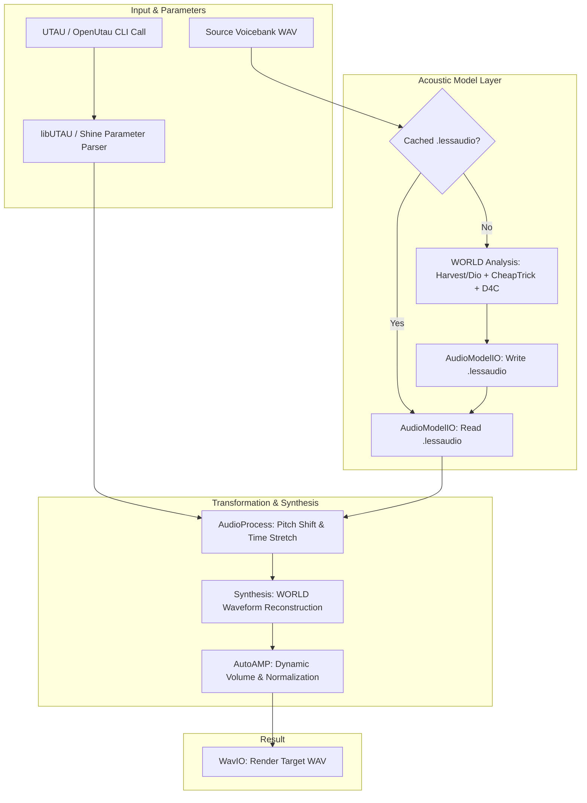

<div align="center">
  
  <h1><b>lessampler-ng</b></h1>
  <p><b>High-Performance Singing Voice Synthesizer & Resampler for UTAU / OpenUtau</b></p>

  <p>
    <a href="https://github.com/dorayakito/lessampler/releases"></a>
    
    
    <a href="LICENSE"></a>
  </p>
</div>

---

## Overview

**lessampler-ng** is a modern, high-performance singing voice synthesis engine and resampler specifically designed for [UTAU](http://utau2008.xrea.jp/) and [OpenUtau](https://github.com/stakira/OpenUtau).

Built with modern **C++20**, lessampler-ng uses advanced acoustic analysis and synthesis techniques based on the **WORLD vocoder** system. It provides high-fidelity pitch shifting, time stretching, fast audio model caching (`.lessaudio`), an interactive Terminal User Interface (**TUI**), and native cross-platform GUI dialogs.

---

## Key Implementations & Features

### 1. Acoustic Model & Vocoder Engine
- **WORLD Vocoder Integration**:
  - **F0 Pitch Estimation**: Supports both **Harvest** (high precision/accuracy) and **Dio** (ultra-fast processing).
  - **Spectral Envelope Analysis**: High-quality formant extraction with **CheapTrick**.
  - **Aperiodicity Estimation**: High-accuracy breath and noise component estimation via **D4C**.
- **Real-time Synthesis**: Time-domain speech waveform reconstruction matching target pitch curves and durations.

### 2. Binary Model Caching (.lessaudio)
- High-efficiency binary serialization format that caches pre-computed F0, spectral envelopes, and aperiodicity matrices.
- Eliminates repeated heavy spectral analysis during note playback in UTAU/OpenUtau.
- Automatic versioning and checksum verification with fallback regeneration.

### 3. Interactive Terminal User Interface (TUI)
- Powered by **FTXUI** with interactive navigation tabs:
  - **Model Generator**: Select voicebank directories with native folder dialogs and batch-generate `.lessaudio` models.
  - **Test Resampler**: Test note synthesis in real time (pitch note, velocity, length, flags) with instant audio output.
  - **Configuration**: Tweak F0 estimation algorithms (Harvest/Dio), FFT size, model amplitude, AP thresholds, and debug flags live.
  - **Help & Shortcuts**: Keyboard navigation guide and engine information.
- **Native GUI Dialogs**: Seamless native OS file/folder pickers integrated via `portable-file-dialogs` on macOS, Linux, and Windows.

### 4. Full UTAU / OpenUtau Protocol Support
- Standard UTAU resampler CLI calling conventions:
  - Pitch note decoding (e.g., `C4`, `A#3`) and custom pitch-bend curve decompression (`!120AA#...`).
  - Tempo adjustments, velocity control, dynamic volume scaling, and sample offset management.
  - Automatic blank audio padding for non-existent reference samples.

### 5. Automatic Post-Processing & Audio I/O
- **AutoAMP**: Automatic amplitude normalization and volume envelope correction.
- **libsndfile Backend**: Robust, multi-format 44.1kHz / 48kHz PCM WAV encoding and decoding.

---

## Architecture & Processing Pipeline



---

## Usage Modes

### 1. Interactive TUI Mode (Recommended for testing & configuration)
Run lessampler without arguments or with the `-i` / `--tui` flag:
```bash
./lessampler
# or
./lessampler -i
```

#### TUI Keyboard Controls:
| Key | Action |
| --- | --- |
| `Tab` / `Shift + Tab` | Navigate between UI widgets |
| `Left` / `Right` / `Up` / `Down` | Switch tabs and select radio options |
| `Enter` | Activate buttons and confirm inputs |
| `Esc` | Quick exit TUI |

---

### 2. UTAU / OpenUtau Resampler Mode (CLI)
lessampler can be directly configured as the resampler engine in UTAU or OpenUtau:

```bash
lessampler <input.wav> <output.wav> <pitch> <velocity> [flags] [offset] [length] [fixed_length] [end_blank] [volume] [tempo] [pitch_bend]
```

#### CLI Argument Reference:
| Position | Argument | Description | Example |
| :---: | :--- | :--- | :--- |
| `1` | `input_wav` | Path to source voicebank WAV file | `voicebank/a.wav` |
| `2` | `output_wav` | Target rendered WAV destination | `temp/temp_0001.wav` |
| `3` | `pitch` | Target musical note or frequency | `C4`, `G#4` |
| `4` | `velocity` | Consonant speed / time stretching percent | `100` |
| `5` | `flags` | Resampler effect flags (optional) | `g-5`, `B50` |
| `6` | `offset` | Start offset in milliseconds | `0` |
| `7` | `length` | Required output duration in milliseconds | `1000` |
| `8` | `fixed_length` | Fixed consonant length in milliseconds | `150` |
| `9` | `end_blank` | Cutoff duration from end of sample (ms) | `0` |
| `10` | `volume` | Output volume percentage (0 - 200%) | `100` |
| `11` | `tempo` | Rendering tempo (BPM) with `!` prefix | `!120` |
| `12` | `pitch_bend` | Base64 pitch bend curve string | `!120AA#...` |

---

### 3. Batch Voicebank Pre-Generator
Pre-compute `.lessaudio` cache files for all samples in a voicebank folder to accelerate note playback:
```bash
lessampler /path/to/voicebank_folder
```

---

## Configuration

lessampler automatically creates and reads a configuration file (`lessampler.ini` / config unit). Key configurable parameters include:

| Setting | Default | Description |
| :--- | :---: | :--- |
| `f0_mode` | `1` (*Harvest*) | `1` = Harvest (High Precision), `2` = Dio (High Speed) |
| `model_amp` | `0.85` | Global model amplitude scaling |
| `fft_size` | `1024` | FFT analysis size |
| `ap_threshold` | `0.10` | Aperiodicity threshold for D4C analysis |
| `f0_dio_floor` | `40.0` | Minimum F0 floor for Dio pitch estimation (Hz) |
| `f0_harvest_floor`| `40.0` | Minimum F0 floor for Harvest pitch estimation (Hz) |
| `f0_cheap_trick_floor` | `71.0` | Spectral floor for CheapTrick |
| `debug_mode` | `false` | Enable verbose logging and debug timers |

---

## Project Structure

```text
lessampler/
├── assets/                  # Icons, Windows resource templates, logo
├── lib/                     # Third-party submodules & libraries
│   ├── ColorCout/           # ANSI colored console outputs
│   ├── dialog/              # Portable File Dialogs (native GUI dialogs)
│   ├── ftxui/               # Functional Terminal User Interface
│   ├── inicpp/              # INI configuration parser
│   ├── rapidjson/           # JSON file serialization
│   ├── sndfile/             # Audio WAV encoding/decoding
│   └── World/               # WORLD speech analysis & synthesis vocoder
├── src/
│   ├── AudioModel/          # Acoustic data models & WORLD wrapper modules
│   ├── AudioProcess/        # Pitch transformation, time-stretch, and AutoAMP
│   ├── ConfigUnit/          # INI configuration manager and versioning
│   ├── Dialogs/             # Cross-platform notifications and file dialogs
│   ├── FileIO/              # Binary (.lessaudio), WAV, and JSON I/O
│   ├── Shine/               # UTAU CLI argument & pitch-bend decoding engine
│   ├── TUI/                 # FTXUI multi-tab control center
│   ├── Utils/               # Logging macros and high-precision timers
│   ├── lessampler.cpp       # Main controller & synthesis pipeline coordinator
│   └── main.cpp             # Application entry point
├── test/                    # Unit tests and test sample assets
└── tools/                   # Utility tools (e.g., parameter exporter)
```

---

## Building from Source

### Prerequisites
- **C++ Compiler**: Supporting **C++20** (GCC 10+, Clang 11+, or MSVC 2019+)
- **CMake**: Version 3.16 or higher
- **Git**: For cloning submodules

### Build Commands

```bash
# 1. Clone the repository including all submodules
git clone --recursive https://github.com/dorayakito/lessampler.git
cd lessampler

# 2. Configure build with CMake
mkdir build && cd build
cmake .. -DCMAKE_BUILD_TYPE=Release

# 3. Compile
cmake --build . --parallel
```

### Running Unit Tests
```bash
ctest --output-on-failure
```

---

## Roadmap

- [x] WORLD Vocoder integration (Harvest, Dio, CheapTrick, D4C)
- [x] High-speed binary `.lessaudio` caching system
- [x] Interactive Terminal User Interface (FTXUI) with native file pickers
- [x] UTAU and OpenUtau CLI pipeline compatibility
- [x] Pitch-bend curve interpolation and AutoAMP gain normalization
- [ ] Timbre / Gender shift flags (`g` flag transformations)
- [ ] Breathiness generation & noise envelope controls (`B` flags)
- [ ] LLSM / Neural vocoder hybrid synthesis
- [ ] Standalone C/C++ Shared Library (`liblessampler`) interface

---

## Special Thanks & Credits

- **[@shine5402](https://github.com/shine5402)**
- **[@hyperzlib](https://github.com/hyperzlib)**
- **WORLD Vocoder**: [Masanori Morise](https://github.com/mmorise/World)
- **FTXUI**: [Arthur Sonzogni](https://github.com/ArthurSonzogni/FTXUI)
- **Portable File Dialogs**: [Sam Hocevar](https://github.com/samhocevar/portable-file-dialogs)

---

## License

lessampler is licensed under the **GNU Lesser General Public License v3.0 (LGPL-3.0)**.  
See the [LICENSE](LICENSE) file for complete license details.

```text
Copyright (c) 2018-2022 YuzukiTsuru <GloomyGhost@GloomyGhost.com>.
```
